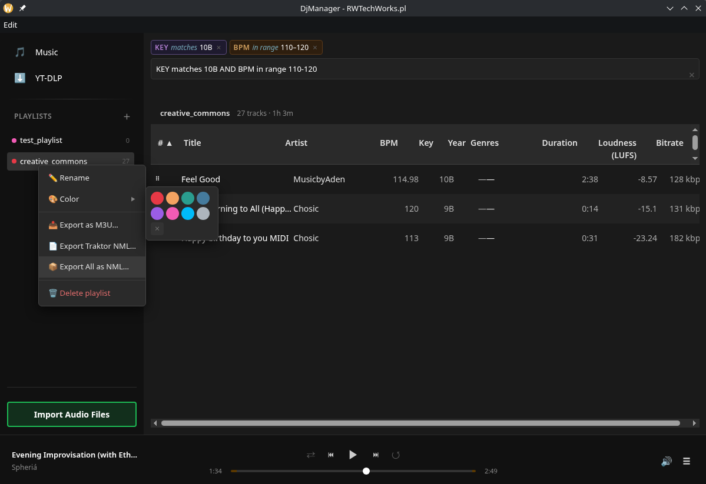

# DJ Manager

A DJ-focused music library manager built with Electron. Manage your tracks, analyze BPM and key, export to Pioneer CDJ USB drives, and download from streaming platforms — all in one offline-first desktop app.



---

## Features

### 🎵 Music Library

- Import **MP3, FLAC, WAV, OGG, M4A, AAC, OPUS** with full metadata extraction
- SHA-1 deduplication — importing the same file twice is a no-op
- Virtualized infinite-scroll list (handles tens of thousands of tracks)
- Sort by any column: title, artist, album, BPM, key, loudness, duration, bitrate, year…
- Customizable column visibility and order, persisted between sessions
- Multi-select with **Ctrl+Click**, **Shift+Click range**, and **Ctrl+A**
- Inline track preview — click the play icon in any row to audition without leaving the library
- Per-track normalization status badge

### 🔍 Search & Filter

- Advanced field-qualified query syntax directly in the search bar:
  ```
  BPM >= 128 AND KEY:8A GENRE is Techno
  ARTIST:Burial YEAR > 2010
  BPM >= 120 AND KEY:12A
  ```
- Supports `AND`, `OR`, field names (`BPM`, `KEY`, `ARTIST`, `ALBUM`, `LABEL`, `GENRE`, `YEAR`, `BITRATE`), and comparison operators (`>=`, `<=`, `>`, `<`, `is`, `contains`)

### 📊 Auto-Analysis

- **BPM** detection via Mixxx analyzer (runs in background worker threads — import never blocks the UI)
- **Musical key** — raw notation + Camelot wheel (e.g. `8B`)
- **Loudness** — LUFS / ReplayGain
- **Intro / Outro** timestamps
- **Beatgrid** generation for CDJ export
- **Waveform** data (PWAV / PWV2 / PWV4 / PWV6) generated via FFmpeg
- Frequency band analysis (bass, mid, treble RMS) per slice

### 🎧 Audio Normalization

- Target loudness configurable in Settings (default **-9 LUFS**, range -60 to 0)
- Original file preserved — normalized copy stored separately, allowing export in either form
- Bulk normalize entire library or selected tracks
- Reset normalization per track or library-wide
- Auto-normalize on import (optional toggle in Settings)
- Player automatically prefers the normalized file when available

### 📝 Metadata & Auto-Tagging

- Edit title, artist, album, label, year, genres, comments — inline or in the details panel
- Bulk metadata editing across multiple selected tracks
- **Auto-tagger** searches MusicBrainz, Discogs, iTunes, and Deezer simultaneously
- Visual diff of current vs. suggested values — accept or reject per field
- Cover art picker with zoom/preview, sourced from MusicBrainz Cover Art Archive, iTunes, and Deezer
- BPM adjust shortcuts: ×2, ×0.5

### 📋 Playlists

- Create, rename, delete playlists (tracks remain in library)
- Add/remove tracks via context menu or drag-and-drop
- Drag-and-drop track reordering within a playlist
- Assign a colour to each playlist (8 presets)
- Import playlist from file — prompts which library playlist to add tracks to
- Export playlist as **M3U**

### ⬇️ Downloads (yt-dlp)

Paste any URL from **YouTube, SoundCloud, Bandcamp, Mixcloud, Vimeo, Twitch, Twitter/X, Instagram, Facebook, TikTok, Dailymotion, Deezer**, and 1000+ other yt-dlp-supported sites.

- Fetch playlist metadata before downloading — preview titles, durations, availability
- Deselect individual tracks from a playlist before starting the download
- Duplicate detection — URLs already in your library are highlighted
- Per-track and overall download progress in the sidebar
- Cancel in-progress downloads
- Browser cookie authentication (Chrome, Chromium, Brave, Firefox, LibreWolf, Edge) for sites requiring login
- Downloaded tracks import directly into the library and optionally into a playlist
- Channel name used as artist when video title contains no artist delimiter

### 🎵 TIDAL Download

Download from TIDAL via the [tidal-dl-ng](https://github.com/Radexito/tidal-dl-ng-For-DJ) integration.

- One-click login via device-link URL (opens in your browser)
- Paste any TIDAL track, album, or playlist URL to download at **HiRes Lossless** quality
- 3-step UI: login → paste URL → select tracks → download
- Duplicate detection — tracks already in your library are flagged before downloading
- Progress shown per track; imported directly into the library with full metadata

### 🎯 Cue Points & Auto-Cue

- **Cue Points Editor** — add, label, colour, and delete hot cues (A–H) and memory cues per track
- **CueGen Auto-Cue** — automatically generates hot cues A–H from the beatgrid (every N bars, configurable)
- Hot cues exported to Rekordbox USB with correct slot assignments, labels, and colours
- Cue marker overlay on the seekbar for visual reference during playback

### 🎮 Player

- Built-in player streaming from a local HTTP server (reliable Range request support for seeking)
- Keyboard shortcuts: **Space** (play/pause), media keys
- Seek bar, volume control, current time / duration
- Output device selection
- Queue management — queue stays in sync when tracks are added to the library or playlist during playback
- **Shuffle** and **Repeat** modes (none / all / one)
- 50-track play history ring buffer

### 💾 Rekordbox USB Export

Full **Pioneer CDJ / XDJ-compatible** export — plug the USB in and it just works.

- Exports the full library or individual playlists
- Writes **ANLZ0000.DAT / .EXT / .2EX** — waveform, beatgrid, intro/outro cue data
  - Hot cue slots **A–H** with correct Pioneer palette colour codes for CDJ hardware (PCPT) and Rekordbox PC (PCP2 extended colour wheel)
  - Memory cues, beatgrid (PQT2), high-res waveform (PWV5), colour waveform (PWV4), preview waveform (PWV3)
- Writes **export.pdb** — full DeviceSQL binary database (tracks, playlists, artwork, keys, ratings)
- Writes **MYSETTING.DAT / MYSETTING2.DAT / DEVSETTING.DAT** — hardware settings with correct CRC-16/XMODEM checksums
- USB filesystem validation (FAT32 / exFAT detection, format warnings)
- Export progress tracking

### ⚙️ Settings

| Section       | Options                                                                                   |
| ------------- | ----------------------------------------------------------------------------------------- |
| Library       | Custom library path, move library to new location                                         |
| Normalization | Target LUFS, auto-normalize on import, bulk normalize / reset                             |
| Downloads     | Browser cookie source, preferred audio format                                             |
| Dependencies  | View installed versions of ffmpeg / yt-dlp / analyzer, update individually or all at once |
| Advanced      | Clear library, reset all user data, view log files                                        |

---

## Download

Pre-built releases are available on the [GitHub Releases](https://github.com/Radexito/DjManager/releases) page.

| Platform | Format              |
| -------- | ------------------- |
| Linux    | AppImage (x64)      |
| macOS    | dmg (Apple Silicon) |
| Windows  | NSIS installer      |

On first launch, FFmpeg and the mixxx-analyzer binary are downloaded automatically.

---

## Development

```bash
# Install dependencies
npm install
cd renderer && npm install && cd ..

# Start dev server (Vite + Electron)
npm run dev

# Lint
npm run lint:all

# Format
npm run format

# Run tests
npm test                    # main process (Vitest)
cd renderer && npm test     # renderer (React Testing Library)

# Build distributable
npm run dist:linux          # or :mac / :win
```

> **Note:** Close the Electron app before running `npm test` — the pretest step rebuilds `better-sqlite3` for Node.js and will fail if Electron holds the binary open.

---

## Tech Stack

| Layer            | Technology                                        |
| ---------------- | ------------------------------------------------- |
| Shell            | **Electron** 40                                   |
| UI               | **React 19** + **Vite 8**                         |
| Database         | **better-sqlite3** (synchronous SQLite)           |
| Analysis         | **Mixxx analyzer** — BPM, key, loudness, beatgrid |
| Audio processing | **FFmpeg** — decode, waveform, format conversion  |
| Downloads        | **yt-dlp**                                        |
| Drag-and-drop    | **@dnd-kit**                                      |
| Virtual list     | **react-window**                                  |

---

## Acknowledgements

A huge thank you to **[meiremans](https://github.com/meiremans)** for creating [beirbox-gui](https://github.com/meiremans/beirbox-gui), which gave us a solid starting point for understanding the Pioneer Rekordbox USB binary format. Their work on reverse engineering the DeviceSQL PDB structure, ANLZ file sections, and USB layout saved an enormous amount of time and made the Rekordbox export feature in DJ Manager possible.

---

## License

MIT © [Radexito](https://github.com/Radexito)
